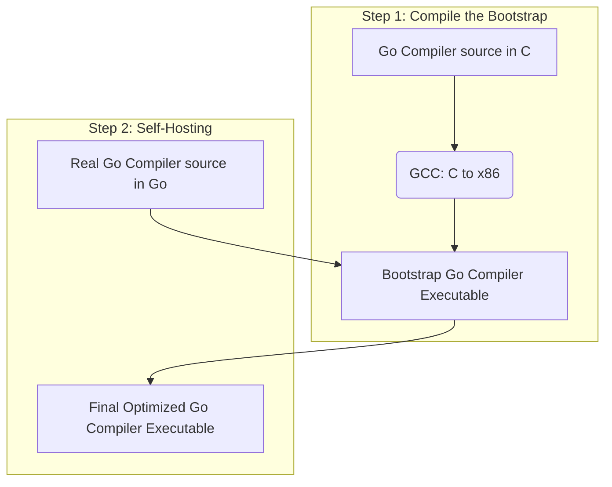

# Compiler Writing Tools and Bootstrapping

## 1. Explanation

### Compiler Writing Tools
Historically, building a compiler was a massive software engineering undertaking involving writing everything from scratch. Over time, compiler writers identified that certain phases of compilation—specifically Lexical Analysis and Syntax Analysis—are highly systematic and mathematically rigorous (based on Finite Automata and Context-Free Grammars). This led to the development of **Compiler Writing Tools** (also known as Compiler-Compilers). 

These tools automate the generation of compiler components:
- **Scanner Generators (e.g., Lex, Flex):** Take Regular Expressions as input and automatically output C/C++ code for a finite automaton that acts as the lexical analyzer.
- **Parser Generators (e.g., Yacc, Bison):** Take Context-Free Grammars (usually LALR(1)) as input and automatically generate the parsing table and parsing logic in C/C++.
- **Syntax-Directed Translation Engines:** Routines that walk the parse tree and generate intermediate code.
- **Data-Flow Analysis Engines / Code-Generator Generators:** Automate the creation of optimization routines and target machine code selection.

### Bootstrapping
**Bootstrapping** is the process of writing a compiler (or assembler) in its own source language. It answers the classic chicken-and-egg problem: *If you write a C compiler in C, how do you compile it the very first time?*

A compiler is characterized by three languages:
1. **Source Language (S):** The language it accepts.
2. **Target Language (T):** The language it generates.
3. **Implementation Language (I):** The language it is written in.

We represent a compiler using a **T-diagram** (or Tombstone diagram), denoted as $C_{S,I,T}$.

To bootstrap a compiler for language L written in language L to run on machine M:
1. Write a small, simplified version of the compiler (subset of L) in an existing language (like C or Assembly) that already runs on M. 
2. Compile this simplified compiler using the existing C/Assembly compiler. Now you have an executable compiler for the subset of L.
3. Write the full compiler for L using the subset of L.
4. Compile the full compiler using the simplified compiler executable. Now you have a full, self-hosted compiler!

## 2. Example

### The Bootstrapping Process (T-Diagram representation)

Let’s say we want to build a Go compiler, written in Go, to run on an x86 machine.
1. We write a Go compiler in C (`Go -> x86` written in `C`).
2. We compile it using `gcc` (`C -> x86` written in `x86`).
3. This yields an executable Go compiler (`Go -> x86` written in `x86`). This is our "Bootstrap Compiler".
4. We then write the *real*, optimized Go compiler entirely in Go.
5. We compile the *real* Go compiler using our Bootstrap Compiler.
6. The output is a highly optimized `Go -> x86` compiler, written in `x86` executable code.

## 3. Applications & Use Cases

- **Self-Hosting Languages:** Almost all modern languages are self-hosted (bootstrapped). The Go compiler is written in Go. The Rust compiler (`rustc`) is written in Rust. The GCC (C compiler) is written in C.
- **Cross-Compilation:** Bootstrapping is heavily used in cross-compilers (e.g., compiling an ARM binary on an x86 host machine). We build a compiler that runs on x86 but targets ARM.
- **Rapid Prototyping (Lex/Yacc):** When designing a new domain-specific language (DSL) or parsing configuration files (like JSON/YAML parsers), engineers use Lex and Yacc to build the parser in hours instead of weeks.

## 4. 3 Solved Numerical/Analytical Examples

**Example 1: Using T-Diagrams for Cross-Compilation**
*Problem:* We have a compiler for language L targeting Machine A, written in A ( $C_{L,A,A}$ ). We want a compiler for L targeting Machine B, to run on Machine B. We have a machine A available. How do we do it?
*Solution:*
1. Write a compiler for L targeting B, written in L. ( $C_{L,L,B}$ )
2. Compile this new source code on Machine A using the existing $C_{L,A,A}$.
   - Operation: $C_{L,L,B}$ + $C_{L,A,A}$ = $C_{L,A,B}$ (This is a cross-compiler running on A, outputting B).
3. Now, we have $C_{L,A,B}$. We take our source code $C_{L,L,B}$ again and compile it using our new cross-compiler $C_{L,A,B}$.
   - Operation: $C_{L,L,B}$ + $C_{L,A,B}$ = $C_{L,B,B}$
4. We have successfully generated the compiler for L, running on B, targeting B!

**Example 2: Identifying the parts of a Lex file**
*Problem:* What are the three standard sections of a Lex (Flex) compiler tool file?
*Solution:*
A `.l` file is structured as:
1. **Definitions:** `%{ ... C declarations ... %}` and macro definitions.
2. **Rules:** `%% ... Regex Pattern { C Action } ... %%`
3. **User Code:** Main function and helper C routines.

**Example 3: Resolving Bootstrapping Errors**
*Problem:* During Stage 3 of a standard GCC bootstrap (where the compiler compiles itself for the second time to verify the binary is identical), the resulting binaries from Stage 2 and Stage 3 differ. What does this imply?
*Solution:* This is called a "bootstrap comparison failure." It implies there is a bug in the compiler's code generation or optimization phases. The compiler compiled itself differently the second time, meaning it is non-deterministic or generating flawed target code.

## 5. Previous Year Questions & Solutions

**[Sample Question Paper]**
**Question:** (a) Explain compiler writing tools and bootstrapping in detail. (5 marks)

**Solution:**
**Compiler Writing Tools:**
Compiler writing tools are specialized software programs that automate the creation of specific phases of a compiler, significantly reducing development time and human error.
1. *Scanner Generators (e.g., Lex):* Automatically generate lexical analyzers from regular expression inputs.
2. *Parser Generators (e.g., Yacc/Bison):* Automatically generate syntax analyzers (parsers) from context-free grammar specifications.
3. *Syntax-Directed Translation Engines:* Produce intermediate code by traversing parse trees based on predefined semantic rules.
4. *Code-Generator Generators:* Generate the back-end code generator based on rules defining the translation of intermediate operations to target machine instructions.

**Bootstrapping:**
Bootstrapping is the technique of writing a compiler in its own source language. This process typically involves a sequence of steps to reach a self-hosting state.
- **The Chicken-and-Egg Problem:** A compiler for language X written in X cannot be compiled without an existing compiler for X.
- **The Solution:** 
  1. Write a small subset of the compiler in a lower-level, already available language (like C).
  2. Use this "bootstrap" compiler to compile the full source code of the compiler written in language X.
  3. The result is a fully functional compiler for X. 
  4. Finally, the full compiler compiles its own source code again to produce a highly optimized version of itself, proving that it is self-hosting. 
This is commonly represented using T-Diagrams indicating the Source, Implementation, and Target languages.
