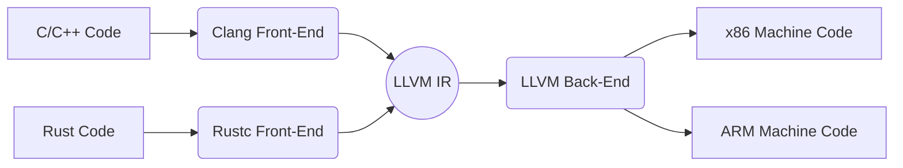

# Grouping of Phases

## 1. Explanation
While a compiler conceptually consists of 6 distinct phases (Lexical, Syntax, Semantic, Intermediate Code Gen, Optimization, Code Gen), in a real-world software engineering implementation, these phases are grouped into logical, cohesive units to improve modularity and compilation speed. 

The primary grouping mechanism is the division into **Front End** and **Back End**.

1. **Front End (Analysis):** 
   - Depends primarily on the *source language* and is largely independent of the target machine.
   - Includes Lexical Analysis, Syntax Analysis, Semantic Analysis, and Intermediate Code Generation.
   - Also includes the creation of the symbol table and error handling related to these phases.
   - **Output:** Intermediate Representation (IR).

2. **Back End (Synthesis):**
   - Depends primarily on the *target machine architecture* and is largely independent of the source language.
   - Includes Code Optimization and Target Code Generation.
   - **Output:** Machine code or Assembly code.

**Passes vs. Phases:**
A *phase* is a logical step. A *pass* refers to reading the input file (or an intermediate representation) completely from start to finish. Multiple phases are often grouped into a single pass to minimize disk I/O. For example, the lexer, parser, and semantic analyzer can be intertwined in a single pass where the parser calls the lexer to get the next token via `getNextToken()`.

## 2. Example
Consider the architecture of the LLVM Compiler Infrastructure:

Because the phases are grouped into Front and Back ends communicating via a common IR, you can mix and match source languages and target architectures without rewriting the whole compiler.

## 3. Applications & Use Cases
- **GCC / LLVM:** The decoupling of the Front-End and Back-End is the cornerstone of modern compiler frameworks. It allows developers to create a new language (e.g., Swift) by only writing a new Front-End that outputs LLVM IR, getting all the Back-End optimizations for ARM and x86 for free.
- **Single-Pass Compilers:** Older languages like Pascal and early C were designed to allow the compiler to group all front-end and back-end phases into a single pass to save memory on early hardware.

## 4. 3 Solved Numerical/Analytical Examples

**Example 1: Identifying Front-End vs Back-End Dependencies**
*Problem:* If Apple releases a new M4 chip (ARM architecture), what part of the Swift compiler needs to be updated?
*Solution:* The Back End. Specifically, the Code Generator phase. The Front End (which parses Swift code and checks types) remains completely unchanged because it is target-independent.

**Example 2: Memory Optimization via Passes**
*Problem:* Why do compilers often group Lexical and Syntax analysis into a single pass rather than running them as two sequential passes?
*Solution:* If Lexical Analysis ran as a full pass, it would have to write millions of tokens to a file or memory buffer. By grouping them, the parser requests one token at a time (`getNextToken()`), drastically reducing the memory footprint (O(1) memory for tokens instead of O(N)).

**Example 3: Cross-Compilation Advantages**
*Problem:* How does the Front-End / Back-End grouping facilitate cross-compilation?
*Solution:* A cross-compiler runs on Machine A but targets Machine B. Because the Back-End is modular, we can compile the source code using the Front-End on Machine A, and then instruct the Back-End module configured for Machine B to generate the target binary, all within the same compiler binary on Machine A.

## 5. Previous Year Questions & Solutions

### Actual University Questions:
**[May 2019]** 5  a)  Explain the different phases in the design of a compiler.

*(Note: Solutions to be generated/verified by agent)*

[April 2018]
**Question:** Discuss the grouping of phases in a compiler. (5 marks)
**Solution:**
In a practical compiler implementation, the theoretical phases are grouped into two main logical blocks:
1. **Front End:** This grouping encompasses all phases that depend solely on the source language and are independent of the target machine. It includes Lexical Analysis, Syntax Analysis, Semantic Analysis, and Intermediate Code Generation. Its primary job is to understand the code, catch errors, and produce a clean Intermediate Representation (IR).
2. **Back End:** This grouping relies on the target machine's architecture and is independent of the source language. It takes the IR produced by the front end and passes it through Code Optimization and Target Code Generation to produce the final executable.
**Advantages of Grouping:** 
- **Retargetability:** A new back end can be written to support a new CPU architecture without touching the front end.
- **Efficiency:** Phases can be grouped into "passes" (e.g., a single pass that scans, parses, and translates) to avoid writing intermediate files to disk, saving I/O overhead.
