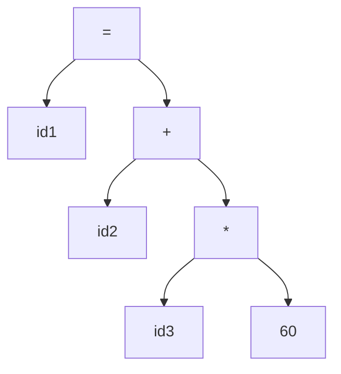

# Introduction to Compilers: Analysis of the Source Program

## 1. Explanation
A compiler translates a source program written in a high-level language into an equivalent target program in a lower-level language (like assembly or machine code). Before generating the target code, the compiler must deeply understand the source code. This understanding is achieved through the **Analysis Phase**, which breaks the source program into constituent pieces and creates an intermediate representation.

The analysis consists of three rigorous steps:
1. **Linear Analysis (Lexical Analysis/Scanning):** The stream of characters making up the source program is read from left to right and grouped into meaningful sequences called *tokens*.
2. **Hierarchical Analysis (Syntax Analysis/Parsing):** Characters or tokens are grouped hierarchically into nested collections with collective meaning. This is usually represented as a *parse tree* or *syntax tree*.
3. **Semantic Analysis:** The compiler checks the source program for semantic errors (e.g., type checking, ensuring variables are declared before use) and gathers type information for the subsequent code generation phase.

If the analysis phase detects any deviations from the lexical, syntactic, or semantic rules of the language, it invokes error handlers to report meaningful messages to the programmer.

## 2. Example
Consider the assignment statement:
`position = initial + rate * 60`

**1. Lexical Analysis:**
Yields tokens: `id1`, `=`, `id2`, `+`, `id3`, `*`, `60`.

**2. Syntax Analysis:**
Yields a syntax tree grouping the operations by precedence (multiplication before addition):

**3. Semantic Analysis:**
Checks if `id1`, `id2`, and `id3` are floats. If so, it converts the integer `60` into a float `60.0` by inserting an `inttofloat` operation in the tree.

## 3. Applications & Use Cases
- **Static Analysis Tools:** Tools like SonarQube or ESLint perform the analysis phase (up to semantic analysis) to find bugs, security vulnerabilities, and code smells without actually generating executable code.
- **Language Servers (LSP):** Modern IDEs (VSCode) use language servers that continuously run the analysis phase in the background to provide intelligent autocompletion and red-squiggles for syntax/semantic errors.

## 4. 3 Solved Numerical/Analytical Examples

**Example 1: Tokenization Count**
*Problem:* How many tokens are in the C statement `int a = b + 10;`?
*Solution:*
1. `int` (Keyword)
2. `a` (Identifier)
3. `=` (Operator)
4. `b` (Identifier)
5. `+` (Operator)
6. `10` (Literal)
7. `;` (Punctuation)
Total: 7 tokens.

**Example 2: Syntax Tree Construction**
*Problem:* Draw the abstract syntax tree for `a = b * c - d`.
*Solution:* Since `*` has higher precedence than `-`:
1. Root is `=`. Left child is `a`. Right child is `-`.
2. For `-`, left child is `*`. Right child is `d`.
3. For `*`, left child is `b`. Right child is `c`.

**Example 3: Semantic Error Identification**
*Problem:* Identify the semantic error in: `int x = "Hello";`
*Solution:* The syntax is perfectly valid (Type Identifier = Literal). However, the semantic analyzer detects a type mismatch: attempting to assign a `string` type to an `int` type variable. This violates the type rules of strongly typed languages like C or Java.

## 5. Previous Year Questions & Solutions
[April 2018]
**Question:** Explain the concept of analysis of the source program in a compiler.
**Solution:**
The analysis of the source program is the front-end of the compilation process. It determines the operations implied by the source program and records them in a hierarchical structure (like a syntax tree). It comprises three main phases:
1. **Lexical Analysis:** Scans the code to produce tokens.
2. **Syntax Analysis:** Groups tokens to form grammatical phrases represented as a parse tree.
3. **Semantic Analysis:** Checks for meaning, primarily focusing on type checking and ensuring variables are declared.
The output of the analysis phase is an intermediate representation of the source code, which is then fed into the synthesis (back-end) phase to generate target machine code.
