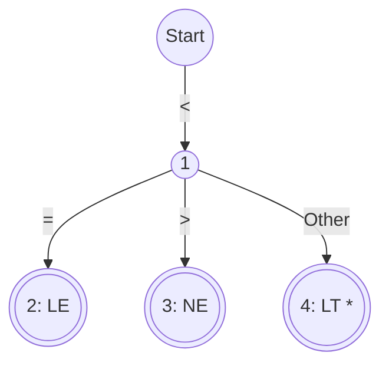

# Recognition of Tokens

## 1. Explanation
Once tokens are specified using Regular Expressions (Regex), the compiler must implement a mechanism to recognize them in the input stream. This involves converting the Regex into a Transition Diagram (a visual flowchart similar to a DFA) and then implementing that diagram in code.

**Transition Diagrams:**
A transition diagram consists of nodes (representing states) and directed edges (representing transitions driven by input characters).
- **Start State:** Where the recognition process begins.
- **Accepting/Final State:** Denoted by a double circle. When reached, the lexer has successfully recognized a token.
- **Retract (`*`):** Sometimes the lexer reads one character too many to determine the end of a token (e.g., reading `=` after `<` to decide between `LESS_THAN` and `LESS_EQUAL`). If the next character doesn't match, the lexer must retract the `forward` pointer by one position. This is denoted by a `*` next to the accepting state.

**Implementation in Code:**
The transition diagram is translated into code using one of two methods:
1. **Switch-Case Statements:** A variable tracks the `state`. Inside a `while` loop, a `switch(state)` block dictates behavior based on the current input character.
2. **Transition Tables:** A 2D array `table[state][character]` holds the next state. The inner loop simply executes `state = table[state][input_char]`.

## 2. Example
Transition Diagram for a Relational Operator (e.g., `<, <=, <>, =, >, >=`):

*Note: Node 4 has a `*` because we read an 'Other' character to realize the token was just `<`, so we must put that 'Other' character back into the buffer.*

## 3. Applications & Use Cases
- **Lex (Flex):** Under the hood, Flex generates massive transition tables in C arrays. The scanner's core is just a tight `while` loop indexing into these arrays to recognize tokens at millions of characters per second.
- **Hand-Written Parsers:** Many production compilers (like GCC) use hand-written recursive descent parsers coupled with hand-written switch-case transition diagrams for lexing, as it allows for superior, highly-customized error messages compared to auto-generated tables.

## 4. 3 Solved Numerical/Analytical Examples

**Example 1: Recognizing Identifiers**
*Problem:* Draw the transition diagram for an identifier defined by `letter (letter | digit)*`.
*Solution:* 
- State 0 (Start).
- Input `letter` $\rightarrow$ State 1.
- From State 1, input `letter` or `digit` $\rightarrow$ Loop back to State 1.
- From State 1, input `Other` $\rightarrow$ State 2 (Accepting state with `*` retract, return `ID` token).

**Example 2: The Retract Operation**
*Problem:* Why is the retract `*` necessary in the identifier example above?
*Solution:* To know that an identifier like `count` has finished, the lexer must read the *next* character (e.g., a space or a `=`). This character is not part of the identifier. The `*` indicates that the lexer must push this non-matching character back onto the input buffer so it can be processed as the start of the next token.

**Example 3: Transition Table Construction**
*Problem:* Create a transition table for recognizing just `a*`.
*Solution:* 
- State 0 (Start), State 1 (Accepting).
- `table[0]['a'] = 1`
- `table[1]['a'] = 1`
- `table[1]['other'] = 2` (State 2 is the accepting state with retract).

## 5. Previous Year Questions & Solutions
[April 2018]
**Question:** Construct a transition diagram for recognizing relational operators. (5 marks)
**Solution:**
A transition diagram for relational operators (`<`, `<=`, `<>`, `=`, `>`, `>=`) requires a start state that branches based on the first character.
1. **Start State 0:** 
   - If input is `<` $\rightarrow$ go to State 1.
   - If input is `=` $\rightarrow$ go to State 5 (Return EQ).
   - If input is `>` $\rightarrow$ go to State 6.
2. **From State 1 (`<` seen):**
   - If input is `=` $\rightarrow$ go to State 2 (Return LE `<=`).
   - If input is `>` $\rightarrow$ go to State 3 (Return NE `<>`).
   - If input is `Other` $\rightarrow$ go to State 4 (Return LT `<`, retract pointer `*`).
3. **From State 6 (`>` seen):**
   - If input is `=` $\rightarrow$ go to State 7 (Return GE `>=`).
   - If input is `Other` $\rightarrow$ go to State 8 (Return GT `>`, retract pointer `*`).
*(Draw the state nodes as circles, with double circles for accepting states 2, 3, 4, 5, 7, and 8, placing a `*` next to 4 and 8).*
