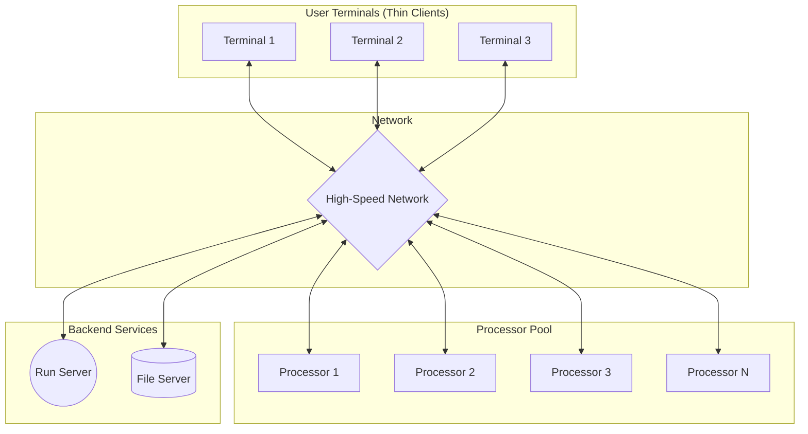

# Processor-Pool Model in Distributed Systems

## Explanation

The **Processor-Pool Model** is a distributed system architecture designed for maximizing resource utilization. Instead of assigning a dedicated, powerful workstation to every single user (which often sits idle when the user is thinking or away), processing power is centralized in a massive "pool" of shared processors (CPUs).

**How it Works:**
1. **Terminals (Thin Clients):** Users interact with the system via basic terminals (like X-terminals) that handle only the display, keyboard, and mouse inputs. They do not perform local computation.
2. **The Processor Pool:** A collection of CPUs, often mounted in racks in a server room. These processors have no attached displays or direct user interfaces.
3. **Run Server / Process Manager:** A specialized component that manages the pool. When a user requests to run an application, the run server finds an idle processor (or a set of them) from the pool and assigns the task to it.
4. **File Servers:** Since the processors in the pool are typically diskless, separate file servers provide storage and data retrieval over the network.

**Block Diagram of Processor-Pool Model:**

**Core Intuition:** The model relies on the statistical multiplexing of processing power. If you have 100 users but only 20 are compiling code at any exact moment, you only need 20 processors in the pool, not 100 dedicated workstations.

## Example

**Amoeba Distributed Operating System**
Developed by Andrew S. Tanenbaum, Amoeba is the classic example of a processor-pool system. 
- A student sits at an X-terminal in the university lab.
- They type `make` to compile a large C program.
- The command goes over the network to the Amoeba Run Server.
- The Run Server identifies 5 idle processors in the pool and allocates them to compile the code in parallel.
- The compiled binary is saved to the central File Server.
- The terminal only displays the compilation logs; no actual compilation happened on the terminal hardware itself.

## Applications & Use Cases

1. **High-Performance Computing (HPC) & Grid Computing:** Environments where jobs require massive parallelism and can be dispatched to any available node (e.g., rendering farms for CGI movies, scientific simulations).
2. **Modern Cloud Computing (Serverless):** AWS Fargate or Google Cloud Run follow a conceptual evolution of the processor-pool model. You submit a container or function, and the cloud provider allocates arbitrary compute from a hidden "pool" to run it, billing only for the active time.
3. **Enterprise Virtual Desktop Infrastructure (VDI):** Users have cheap Chromebooks (terminals), while heavy applications run on a centralized cluster of servers.

## 3 Solved Numerical/Analytical Examples

**Example 1: Calculating Resource Utilization**
*Problem:* A company has 100 developers. Each developer actively compiles code for exactly 6 minutes every hour. They are considering buying 100 workstations (1 processor each) OR building a processor pool. Assuming requests are perfectly spread out, how many processors are needed in the pool to guarantee zero wait time? What is the utilization of the pool versus the workstations?
*Solution:*
1. **Active Time per User:** $6 \text{ mins} / 60 \text{ mins} = 10\%$ active time.
2. **Workstation Model:** Requires 100 processors. Utilization = 10% (90% of the time, the CPU is idle).
3. **Processor-Pool Model:** Total active time needed per hour = $100 \text{ users} \times 6 \text{ mins} = 600 \text{ minutes of compute}$.
4. Since 1 processor provides 60 minutes of compute per hour, the minimum processors needed = $600 / 60 = 10$ processors.
5. **Pool Utilization:** The 10 processors will be running at 100% utilization.
This demonstrates massive cost savings by avoiding idle hardware.

**Example 2: Analyzing Queuing Delay (M/M/1 Approximation)**
*Problem:* In a processor pool with a single unified queue, compilation jobs arrive at a rate of $\lambda = 4$ jobs/minute. The pool processes jobs at an average rate of $\mu = 5$ jobs/minute. Calculate the average time a job spends in the system (waiting + execution).
*Solution:*
1. Using standard M/M/1 queue formula: $T = \frac{1}{\mu - \lambda}$.
2. Substitute values: $T = \frac{1}{5 - 4} = \frac{1}{1} = 1$ minute.
3. A job spends an average of 1 minute in the system. 
*(Note: If arrival rate $\lambda$ approaches 5, the delay would skyrocket, highlighting the need to dynamically scale the processor pool).*

**Example 3: Amdahl's Law in a Processor Pool**
*Problem:* A user submits a job to the Run Server that takes 50 seconds on a single processor. 20% of the job is inherently sequential (setting up the environment, writing the final file), while 80% can be perfectly parallelized. If the Run Server allocates 8 idle processors from the pool to this job, what is the new execution time?
*Solution:*
1. Total Time $T_1 = 50$s.
2. Sequential Fraction $F = 0.2$. Parallel Fraction $P = 0.8$.
3. Time on $N$ processors: $T_N = T_1 \times (F + \frac{P}{N})$.
4. Substitute $N = 8$: $T_8 = 50 \times (0.2 + \frac{0.8}{8})$.
5. $T_8 = 50 \times (0.2 + 0.1) = 50 \times 0.3 = 15$ seconds.
The processor pool reduces the job time from 50 seconds to 15 seconds.

## Previous Year Questions & Solutions

**[April 2019] What is a processor pool model? How does it differ from the workstation model in distributed computing?**
*Solution:*
**Processor-Pool Model:**
The processor pool model is an architecture where all processing power is centralized into a "pool" of CPUs rather than distributed among user terminals. Users access the system through thin clients or X-terminals that handle only I/O (display and keyboard). When a user executes a command, a centralized "Run Server" allocates one or more processors from the pool to execute the task, and the output is routed back to the terminal.

**Differences from Workstation Model:**
1. **Location of Compute:** In the workstation model, each user sits at a fully-equipped computer (with its own CPU, disk, and memory) where most of their tasks execute locally. In the processor-pool model, terminals have no compute capability; all logic runs in the server room.
2. **Resource Utilization:** Workstations are often highly underutilized (e.g., sitting idle while a user reads a document). The processor pool achieves near-perfect statistical multiplexing, as idle CPUs are immediately assigned to other active users.
3. **Scalability:** Expanding a processor pool is as simple as racking more CPUs in the server room. Upgrading workstations requires replacing hardware at every user's desk.
4. **Data Management:** Workstations often have local disks leading to fragmented data, whereas the processor pool relies entirely on centralized network file servers, simplifying backups and consistency.

**[December 2020] Draw the architecture of the processor pool model and explain the function of the Run Server.**
*Solution:*
*(See the Mermaid diagram provided in the Explanation section detailing Terminals, Network, Processor Pool, Run Server, and File Server).*

**Function of the Run Server:**
The Run Server (or Process Manager) acts as the brain of the processor pool. Its primary responsibilities are:
1. **Resource Monitoring:** Constantly tracking which processors in the pool are idle, busy, or offline.
2. **Job Scheduling:** Accepting execution requests from user terminals and queuing them.
3. **Allocation:** Dynamically assigning processes to available processors based on load balancing algorithms to ensure no single CPU is bottlenecked while others remain idle.
4. **Teardown:** Reclaiming the processor back into the "idle pool" once a job is completed, so it can be assigned to the next user request.
