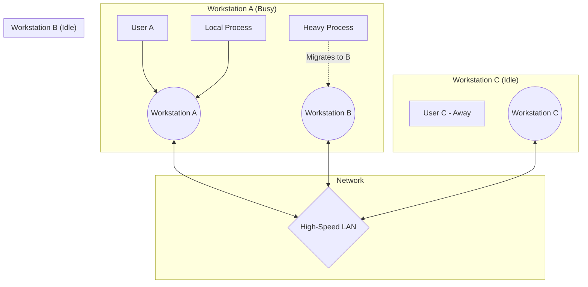

# Workstation Model in Distributed Systems

## Explanation

The **Workstation Model** is a fundamental architecture in distributed systems that emerged with the proliferation of personal computers and powerful engineering workstations in the 1980s. Unlike the Minicomputer Model (where users shared a single CPU via dumb terminals) or the Processor-Pool Model (where all CPUs live in a central server room), the Workstation Model places dedicated processing power directly on every user's desk.

**Core Concept:**
Every user is assigned their own personal workstation consisting of a CPU, local memory, a display, and typically a local disk. These workstations are connected via a high-speed Local Area Network (LAN). 

**The "Idle Workstation" Paradigm:**
The most interesting distributed aspect of this model is the handling of **idle workstations**. Since an average user (e.g., writing a document or reading an email) barely uses a fraction of their workstation's processing power—and workstations are often completely idle overnight or during meetings—the system can dynamically allocate computational tasks from heavily loaded workstations to these idle ones. 

To implement this, the system requires:
1. A mechanism to detect when a workstation is "idle" (e.g., no mouse/keyboard input for 5 minutes).
2. A registry where idle workstations announce their availability.
3. A remote execution protocol allowing a busy workstation to migrate a process (like compiling a large codebase) to an idle machine.
4. An eviction protocol: If the owner of the idle workstation returns and moves the mouse, the foreign process must be immediately paused, migrated away, or killed to ensure the owner experiences zero lag.

**Block Diagram of Workstation Model:**

## Example

**Sprite Distributed Operating System**
Sprite is a classic OS that implemented the workstation model. 
Imagine an animation studio with 50 artists, each with a high-end graphics workstation. 
- Artist A is actively rendering a complex 3D frame, which overloads their machine. 
- Artist B has gone to lunch, leaving their workstation idle. 
- The Sprite OS automatically detects Artist B's idle state, grabs part of Artist A's rendering job, and processes it transparently on Artist B's machine. 
- When Artist B returns and touches the mouse, Sprite instantly halts the foreign render process and migrates it back or to another idle machine so Artist B can work without interruption.

## Applications & Use Cases

1. **Academic and Research Labs:** Universities with hundreds of student workstations. When students leave at night, the entire lab effectively becomes a massive supercomputer (e.g., using HTCondor to run scientific simulations).
2. **Distributed Compiling:** Tools like `distcc` allow a developer to compile a massive C++ project by distributing the compilation of individual files across all idle workstations in the office.
3. **SETI@home (Volunteer Computing):** While not a traditional LAN, this is a global scale iteration of the workstation model where users donate their idle home PC cycles to search for extraterrestrial intelligence.

## 3 Solved Numerical/Analytical Examples

**Example 1: Analyzing Available Compute Power**
*Problem:* A corporate network has 200 workstations. On average, a user is actively using their workstation for 4 hours during an 8-hour workday, and the workstations are left on overnight. Assuming "active use" consumes 20% of the CPU and "idle" consumes 0%, how many equivalent full-time processors of compute power are completely wasted and available for distributed tasks per 24-hour day?
*Solution:*
1. Workday Active Time: 4 hours (at 20% load, 80% idle) + 4 hours (100% idle).
2. Overnight Time: 16 hours (100% idle).
3. Total Idle Hours per workstation per day = $(4 \times 0.8) + (4 \times 1.0) + (16 \times 1.0) = 3.2 + 4 + 16 = 23.2$ hours.
4. Total compute available across 200 machines = $200 \times 23.2 = 4640$ compute hours/day.
5. Equivalent full-time processors = $4640 / 24 = 193.33$.
Thus, out of 200 processors, an equivalent of roughly 193 processors' worth of power is completely idle and could be harvested.

**Example 2: Cost of Process Migration**
*Problem:* Workstation A is overloaded and decides to migrate a running process to idle Workstation B. The process has a memory footprint of 50 MB. The LAN bandwidth is 100 Mbps (Megabits per second). There is a fixed protocol overhead of 100 ms for migration setup. How long does the migration take, and is it worth it if the process only has 2 seconds of execution remaining?
*Solution:*
1. Convert memory to Megabits: $50 \text{ MB} \times 8 \text{ bits/byte} = 400 \text{ Mb}$.
2. Network transfer time = $400 \text{ Mb} / 100 \text{ Mbps} = 4$ seconds.
3. Total Migration Time = Transfer Time + Setup Overhead = $4 \text{ s} + 0.1 \text{ s} = 4.1$ seconds.
4. **Conclusion:** If the process only needs 2 seconds to finish locally, migrating it takes 4.1 seconds. It is **not worth it**. Migration is only beneficial for long-running CPU-bound tasks.

**Example 3: Probability of Eviction**
*Problem:* A migrated job takes $T = 30$ minutes to run on an idle workstation. The owner of the workstation returns according to a Poisson process with an average rate of $\lambda = 1$ return per hour (or $\frac{1}{60}$ returns per minute). What is the probability that the distributed job completes without being evicted?
*Solution:*
1. We want the probability of 0 returns in $T = 30$ minutes.
2. The expected number of returns in 30 minutes is $\lambda T = (\frac{1}{60}) \times 30 = 0.5$.
3. Using the Poisson probability mass function $P(x=0) = \frac{e^{-\lambda T} (\lambda T)^0}{0!} = e^{-0.5}$.
4. $e^{-0.5} \approx 0.606$.
There is a 60.6% chance the job finishes uninterrupted, and a 39.4% chance it will be evicted before completion.

## Previous Year Questions & Solutions

**[April 2019] Explain the workstation model of distributed computing. How does it handle idle workstations?**
*Solution:*
**Workstation Model:**
In the workstation model, the distributed system consists of individual personal computers (workstations) connected by a high-speed LAN. Each user has exclusive access to their own workstation, which contains its own CPU, memory, and disk. This provides a highly predictable and responsive environment for the user, as they are not competing for CPU cycles with others on a shared mainframe.

**Handling Idle Workstations:**
The primary distributed challenge is utilizing the massive amount of wasted CPU cycles when users step away from their desks. The system handles this through **process migration**. 
1. **Idle Detection:** A background daemon monitors mouse/keyboard activity to declare a machine "idle."
2. **Registry:** Idle machines register themselves with a central coordinator.
3. **Execution:** Heavily loaded workstations request an idle machine and migrate processes over the network to execute remotely.
4. **Eviction:** If the owner returns to the idle workstation, the foreign process is immediately terminated or suspended and migrated away to ensure the owner experiences no performance degradation.

**[December 2021] Compare and contrast the Workstation Model with the Processor-Pool Model.**
*Solution:*
1. **Compute Location:** In the Workstation Model, processing power is distributed across every user's desk. In the Processor-Pool Model, terminals are "dumb" (no CPU), and all processing power is centralized in a massive pool of shared CPUs in a server room.
2. **Resource Utilization:** The Workstation Model suffers from inherent underutilization because processors sit idle when users are away (requiring complex process migration to fix). The Processor-Pool model inherently solves this through statistical multiplexing; idle CPUs are instantly reassigned to active users.
3. **User Experience:** Workstation users get guaranteed performance because they own the hardware. Processor-pool users share hardware, meaning extreme system load could slow everyone down.
4. **Complexity:** The Workstation Model requires highly complex process migration and eviction protocols to handle owners returning. The Processor-Pool model is simpler to manage because processors have no "owners" to interrupt.
