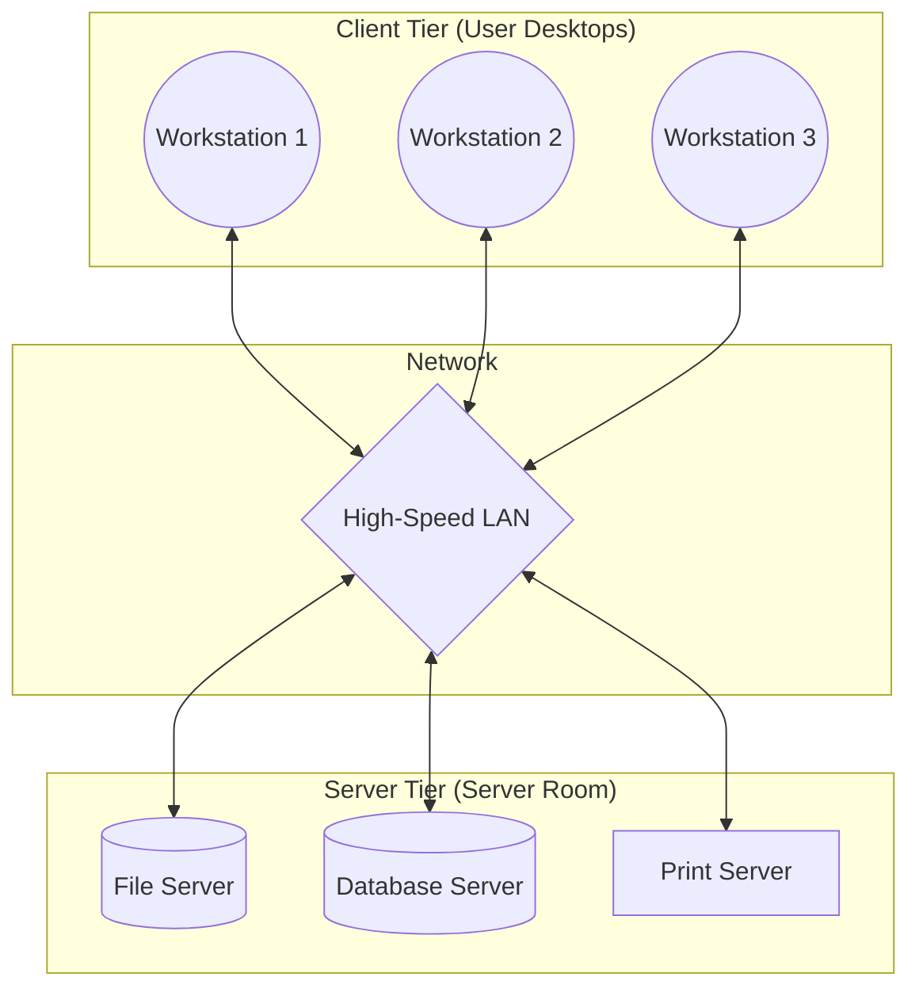

# Workstation-Server Model in Distributed Systems

## Explanation

The **Workstation-Server Model** is a hybrid architectural model that combines the best aspects of the Workstation Model and the centralized mainframe approach. It is the direct precursor to the modern Client-Server architecture and remains the dominant paradigm in corporate and enterprise networks today.

In this model, the distributed system is divided into two distinct classes of computers:
1. **Workstations (Clients):** Each user has a dedicated personal workstation on their desk. These machines have their own CPU and memory to handle user interfaces, local processing, and running application logic. However, they are often diskless or have very small local disks.
2. **Servers:** Powerful, centralized machines located in a secure server room. These machines do not have dedicated users sitting at them. Instead, they run specialized background software designed to provide services to the workstations over the network.

**Types of Servers:**
- **File Server:** Provides centralized storage (e.g., NFS - Network File System). This ensures all data is backed up centrally, and a user can log into *any* workstation and access their identical files.
- **Print Server:** Manages print queues for expensive, high-capacity printers shared by the entire office.
- **Database Server:** Runs heavy RDBMS engines (like Oracle or PostgreSQL) to process complex queries, sending only the results back to the workstation.

**Block Diagram of Workstation-Server Model:**

**Why use it?**
It strikes a perfect balance. It gives users guaranteed local compute power for interactive tasks (like rendering graphics or typing) so they don't experience network lag, while centralizing data and heavy, shared resources to make administration, security, and backups incredibly efficient.

## Example

**A Modern Enterprise Office (Active Directory & File Shares)**
Imagine a typical corporate office building.
- An accountant sits at **Workstation 1** (a standard Dell PC). They open a massive Excel spreadsheet. The rendering of the UI and the calculation of formulas happen locally using the workstation's CPU and RAM.
- However, the Excel file itself is not saved on the PC. When they hit "Save", the file is sent over the LAN to the central **File Server**.
- Later, the accountant needs to print a 500-page report. Instead of freezing their workstation, the document is sent to the **Print Server**, which manages the queue and talks to the heavy-duty laser printer down the hall. 

## Applications & Use Cases

1. **Corporate Intranets:** ALmost every office uses this model to separate user compute (laptops/desktops) from centralized data management (Network Attached Storage, Active Directory).
2. **Thin Client Environments:** Booting an OS directly from the network (PXE Boot). The workstation uses its CPU to run the OS, but fetches the OS image and all data from the server.
3. **Web Applications:** In its evolved form (Client-Server), your browser (Workstation) renders the HTML/CSS and runs JavaScript locally, while the Backend (Server) handles the database queries and heavy business logic.

## 3 Solved Numerical/Analytical Examples

**Example 1: Diskless Workstation Boot Time**
*Problem:* An office has 50 diskless workstations that all boot simultaneously at 9:00 AM. Each workstation must download a 100 MB operating system image from the File Server. The File Server's network interface has a maximum throughput of 1 Gbps (Gigabits per second). How long will it take for all 50 workstations to finish booting?
*Solution:*
1. Total data to transfer = $50 \text{ workstations} \times 100 \text{ MB} = 5000 \text{ MB}$.
2. Convert to Megabits: $5000 \text{ MB} \times 8 \text{ bits/byte} = 40,000 \text{ Mb}$.
3. Server bandwidth = $1 \text{ Gbps} = 1000 \text{ Mbps}$.
4. Time = $\frac{40,000 \text{ Mb}}{1000 \text{ Mbps}} = 40$ seconds.
It will take 40 seconds for the network transfer to complete. (This highlights the "boot storm" bottleneck common in workstation-server setups).

**Example 2: Analyzing Network vs Local Cache Performance**
*Problem:* A workstation accesses a 5 KB file 100 times an hour. Fetching it from the remote File Server takes 20 ms. If the workstation implements a local RAM cache, accessing the cache takes 1 ms, but the cache only has an 80% hit rate. What is the average time saved per hour by using the cache?
*Solution:*
1. **Without Cache:** 100 accesses $\times 20$ ms = 2000 ms total time.
2. **With Cache:**
   - 80 accesses (hit) $\times 1$ ms = 80 ms.
   - 20 accesses (miss) $\times (1 \text{ ms (cache check)} + 20 \text{ ms (fetch)}) = 20 \times 21 = 420$ ms.
   - Total time with cache = $80 + 420 = 500$ ms.
3. **Time Saved:** $2000 - 500 = 1500$ ms per hour.
Caching is a vital mechanism in the Workstation-Server model to reduce network dependency.

**Example 3: Server Sizing (Queueing Theory)**
*Problem:* A Print Server receives print jobs at a rate of $\lambda = 2$ jobs per minute. The server can process and spool jobs to the printer at a rate of $\mu = 3$ jobs per minute. What is the average number of print jobs waiting in the queue?
*Solution:*
1. This is an M/M/1 queue.
2. The utilization factor $\rho = \lambda / \mu = 2 / 3$.
3. The average number of jobs in the queue (waiting line) is given by $L_q = \frac{\rho^2}{1 - \rho}$.
4. $L_q = \frac{(2/3)^2}{1 - 2/3} = \frac{4/9}{1/3} = \frac{4}{9} \times 3 = \frac{4}{3} = 1.33$ jobs.
The server must have enough memory buffer to hold at least 1-2 jobs on average.

## Previous Year Questions & Solutions

**[April 2020] Distinguish between the Workstation Model and the Workstation-Server Model.**
*Solution:*
1. **Data Storage:** In the pure Workstation Model, users store their files on the local disk of their specific workstation. In the Workstation-Server Model, workstations are often diskless, and all user data is stored centrally on a dedicated File Server.
2. **Mobility:** In the Workstation Model, a user is tied to their specific physical machine because their files are there. In the Workstation-Server Model, a user can log into any workstation in the building, and the File Server will mount their personal data over the network seamlessly.
3. **Administration & Backups:** Backing up data in the Workstation Model is a nightmare, as admins must back up hundreds of individual PCs. The Workstation-Server model makes this trivial, as only the central server needs to be backed up.
4. **Compute Sharing:** The Workstation Model aggressively focuses on sharing idle CPU cycles (process migration). The Workstation-Server model generally does not; each workstation runs its own tasks, and heavy shared tasks are offloaded explicitly to the servers, not to other idle workstations.

**[December 2019] Draw a diagram for the Workstation-Server model. What is the role of a File Server in this architecture?**
*Solution:*
*(Refer to the Mermaid block diagram in the Explanation section detailing the Client Tier and Server Tier connected by a LAN).*

**Role of a File Server:**
The File Server provides a centralized, network-accessible storage repository. Its roles include:
1. **Centralized Storage:** Acting as a massive hard drive that is virtually mounted onto the clients (via protocols like NFS or SMB).
2. **Concurrency Control:** Ensuring that if two users on different workstations try to edit the same file simultaneously, the file is locked to prevent corruption.
3. **Security:** Implementing access control lists (ACLs) to ensure users can only read/write files they have permissions for.
4. **Fault Tolerance:** File servers typically use RAID disk arrays to prevent data loss if a hard drive fails.
