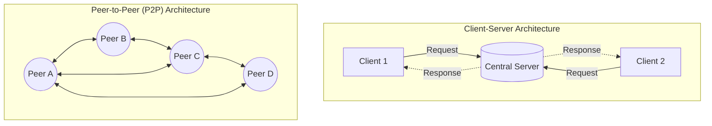

# Architectural Models in Distributed Systems

## Explanation

As a systems engineer, before writing a single line of code, you must define the **Architectural Model** of your distributed system. While physical models describe the hardware, an architectural model abstracts away the physical network and focuses entirely on the logical organization of software components. It answers three fundamental questions:
1. *Where* is the state stored?
2. *Where* does the computation happen?
3. *How* do the components discover and communicate with one another?

The goal is to structure the system to meet non-functional requirements: reliability, manageability, adaptability, and cost-effectiveness. 

The primary architectural models are:

1. **Client-Server Model**: 
   The most prevalent model. Processes are strictly divided into clients (requesters of service) and servers (providers of service). It is centralized and asymmetric.
2. **Peer-to-Peer (P2P) Model**: 
   A decentralized model where all processes (peers) play identical roles, interacting cooperatively without any distinction between clients and servers.
3. **Multi-Tier Architectures**: 
   An extension of Client-Server where the server-side logic is split into multiple tiers (e.g., Presentation, Business Logic, Data layers) to allow independent scaling.
4. **Variants and Extensions**:
   - **Proxy Servers and Caches**: Intermediary nodes placed close to clients to store recently accessed data, reducing latency and network traffic to the origin server.
   - **Mobile Code**: Executable code is downloaded from a server and executed locally on the client's machine (e.g., JavaScript in browsers).
   - **Mobile Agents**: A running program (including its code, data, and execution state) that pauses execution, travels across the network to another node, and resumes execution there.

**Block Diagram of Architectural Models:**

## Example

**Web Browsing vs. File Sharing**
- **Client-Server (Web Browsing):** When you navigate to an online store, your browser (Client) explicitly requests a web page from an Apache/Nginx web server. The server fetches the data from a backend database and sends the HTML back. If the server crashes, the site goes down entirely. The client is lightweight; the server does the heavy lifting.
- **Peer-to-Peer (BitTorrent):** When you download a massive Linux ISO via BitTorrent, you don't download it from a single central server. Instead, your torrent client connects to a "swarm" of dozens of other users (peers) who already have pieces of the file. You download chunk #1 from Peer A, chunk #2 from Peer B, and simultaneously upload chunk #3 (which you already have) to Peer C. There is no central point of failure, and the system scales naturally—more users mean more upload bandwidth.

## Applications & Use Cases

1. **Content Delivery Networks (CDNs):** CDNs (like Cloudflare or Akamai) utilize the **Proxy Server / Cache** extension. They place edge servers physically close to users around the globe. When a user in India requests a video hosted in the US, the CDN serves a cached copy from a proxy server in Mumbai, drastically cutting latency.
2. **Cryptocurrency & Blockchain:** Bitcoin and Ethereum rely heavily on a pure **Peer-to-Peer model**. Every full node maintains a complete copy of the distributed ledger. Consensus is reached collectively without a central banking authority.
3. **Modern Microservices:** These utilize heavily distributed **Multi-Tier** client-server models, where a single API gateway (Server) routes requests to dozens of independent backend microservices, which in turn act as clients to distributed databases.

## 3 Solved Numerical/Analytical Examples

**Example 1: Analyzing Bottlenecks in Client-Server Architecture**
*Problem:* A single origin server handles requests from $N = 1000$ clients. Each client makes 10 requests per second. The server takes exactly 2 milliseconds to process a single request. Will the server be able to handle the load, or will it form a bottleneck?
*Solution:*
1. Total request arrival rate ($\lambda$) = $1000 \text{ clients} \times 10 \text{ req/sec} = 10,000 \text{ requests/sec}$.
2. Service rate ($\mu$) of the server = $\frac{1}{0.002 \text{ seconds}} = 500 \text{ requests/sec}$.
3. Since $\lambda (10,000) \gg \mu (500)$, the server is fundamentally incapable of handling the load. It needs 20 seconds of processing time for every 1 second of real time.
4. *Conclusion:* The architecture must be redesigned using an extension (like load-balanced multiple servers or adding proxy caches) to distribute the $10,000$ req/sec load.

**Example 2: Caching Efficiency in Proxy Servers**
*Problem:* A distributed system introduces a proxy server close to a cluster of clients. The proxy cache has a hit rate of $h = 85\%$. Fetching data from the proxy cache takes $t_c = 12$ ms. If a cache miss occurs, the proxy must fetch data from the remote origin server, which takes $t_m = 250$ ms. Calculate the expected average response time for a client request.
*Solution:*
1. The expected response time $E[T]$ is given by the weighted average of hits and misses:
   $E[T] = (h \times t_c) + ((1 - h) \times t_m)$
2. Substitute the given values:
   $E[T] = (0.85 \times 12) + (0.15 \times 250)$
3. $E[T] = 10.2 + 37.5 = 47.7$ ms.
4. *Conclusion:* By caching just 85% of requests at the edge, the average latency is reduced from a painful 250 ms to a highly responsive 47.7 ms.

**Example 3: Peer-to-Peer vs. Client-Server Distribution Time**
*Problem:* You need to distribute a file of size $F = 10$ GB to $N = 100$ peers. The central server has an upload capacity $U_s = 1$ GB/s. In a Client-Server model, the server sends the file to each client one by one. In a theoretical perfect P2P model, the peers assist in uploading. Calculate the distribution time for the Client-Server model.
*Solution:*
1. **Client-Server Model:** The server must upload the 10 GB file 100 separate times.
   Total data to upload = $N \times F = 100 \times 10 = 1000$ GB.
   Time $T = \frac{\text{Total Data}}{U_s} = \frac{1000 \text{ GB}}{1 \text{ GB/s}} = 1000$ seconds.
2. *(Bonus Intuition)*: In a perfect P2P model, the server only uploads the file *once* to the swarm ($10$ seconds), and the peers use their own upload bandwidth to share the chunks among themselves, drastically reducing the burden on the server.

## Previous Year Questions & Solutions

**[April 2018] What is an architectural model? Explain the Client-Server and Peer-to-Peer models in detail.**
*Solution:*
**Architectural Model:**
An Architectural Model is a high-level abstract representation that defines the structure of a distributed system in terms of its separately specified software components and their logical interrelationships. It dictates where computation occurs, where state is maintained, and how components communicate, effectively ignoring the underlying physical network topology. The goal is to design for reliability, scalability, and adaptability.

**1. Client-Server Model:**
This is a centralized architecture where processes are strictly divided into two roles. **Servers** are powerful, always-on processes that manage resources (like databases or files) and offer services. **Clients** are active processes that require those services. Communication follows a strict Request-Reply protocol: the client sends a request over the network to the server, the server processes it, and returns a response. 
*Advantages:* Centralized control, easier security, and simple consistency management.
*Disadvantages:* The server is a single point of failure and a severe scalability bottleneck.

**2. Peer-to-Peer (P2P) Model:**
This is a decentralized architecture where all processes (peers) act as both clients and servers simultaneously. There is no rigid hierarchy. Peers cooperatively interact to perform a distributed activity, such as file sharing or maintaining a blockchain ledger. When a peer needs data, it requests it from another peer; when a peer has data, it serves it to others.
*Advantages:* Massive scalability (adding nodes adds both demand *and* supply/bandwidth) and no single point of failure.
*Disadvantages:* Highly complex to manage, difficult to guarantee data security, and finding specific data across the decentralized network can be slow.
