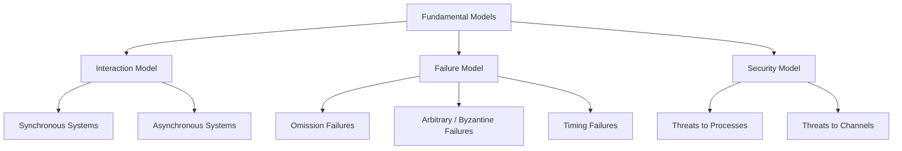

# Fundamental Models in Distributed Systems

## Explanation

As an engineer designing a distributed system, you cannot solely rely on physical architectures (hardware) or logical architectures (client-server). You must understand the underlying, abstract laws of physics that govern distributed computation. This is where **Fundamental Models** come in. They isolate and formalize the core properties of process interaction, system failures, and security threats. 

By defining these boundaries, fundamental models allow us to mathematically prove whether an algorithm (like consensus or mutual exclusion) is correct, fault-tolerant, and secure under specific real-world conditions.

There are three primary fundamental models:

### 1. The Interaction Model
Distributed processes must interact via message passing over a network, bringing the challenges of variable latency and lack of a global clock. The interaction model defines the timing assumptions of the system.
- **Synchronous Distributed Systems:** A highly constrained, theoretical model where:
  1. The time to execute each step of a process has known lower and upper bounds.
  2. Each message transmitted over a channel is received within a known bounded time.
  3. Each process has a local clock whose drift rate from true time has a known bound.
  *Why use it?* If you can prove an algorithm fails in a synchronous system, it will definitively fail in an asynchronous one. It's used for critical real-time systems.
- **Asynchronous Distributed Systems:** A realistic model (representing the Internet) where:
  1. There are **no bounds** on process execution speeds.
  2. There are **no bounds** on message transmission delays.
  3. There are **no bounds** on clock drift rates.
  *Challenge:* In an asynchronous system, it is impossible to distinguish between a crashed process and a very slow process (the famous FLP Impossibility Result).

### 2. The Failure Model
Hardware and software will fail. The Failure Model mathematically categorizes *how* they fail, so we can design algorithms to tolerate them.
- **Omission Failures:** A component simply fails to perform an action. 
  - *Process Omission (Fail-Stop / Crash):* A process halts and remains halted.
  - *Channel Omission:* A network link drops a message due to buffer overflow or corruption.
- **Arbitrary (Byzantine) Failures:** The worst-case scenario. A component exhibits completely random, unpredictable, or maliciously crafted behavior. A router might duplicate messages, alter their contents, or a node might lie about its state to confuse the network.
- **Timing Failures:** Applicable only in synchronous systems. Occurs when a process executes too slowly/quickly, or a message arrives after its strict deadline.

### 3. The Security Model
This model abstracts the threats facing an open, distributed system to ensure confidentiality, integrity, and availability.
- **Threats to Processes:** Spoofing (an attacker masquerades as a legitimate server) or Denial of Service (flooding a node to exhaust its resources).
- **Threats to Channels:** Eavesdropping (passively reading private messages) or Man-in-the-Middle attacks (actively intercepting and altering messages).

**Taxonomy of Fundamental Models:**

## Example

**A Global Bank Transfer System**
Imagine you wire \$10,000 from a bank in New York to a bank in Tokyo.
- **Interaction Model:** The database engineers must assume an **Asynchronous** model. The TCP/IP packets traveling under the Pacific Ocean might take 50ms, or 5 seconds if rerouted. The software cannot hardcode an assumption that "if it takes longer than 1 second, it failed."
- **Failure Model:** The system must handle **Omission Failures**. If the New York database deducts the money, sends the "credit Tokyo" message, and the transatlantic cable is severed (Channel Omission), the system must use two-phase commit protocols to rollback the New York deduction.
- **Security Model:** The financial data must be protected against **Channel Threats** (eavesdropping) using strong TLS encryption and digital signatures.

## Applications & Use Cases

1. **Consensus Algorithms in Blockchain:** Systems like Bitcoin are designed entirely around an *Asynchronous Interaction Model* and an *Arbitrary (Byzantine) Failure Model*. They assume network delays are infinite and nodes will actively lie to steal cryptocurrency.
2. **Aircraft Fly-by-Wire Systems:** Built strictly on a *Synchronous Interaction Model*. When a pilot pulls the yoke, the sensor data must reach the actuator within a strict microsecond deadline. A *Timing Failure* here is treated as catastrophically as a hardware crash.
3. **Secure Web Services (HTTPS):** Explicitly addresses the *Security Model* by employing public-key infrastructure to authenticate the server (preventing process spoofing) and symmetric encryption to protect the channel.

## 3 Solved Numerical/Analytical Examples

**Example 1: Byzantine Fault Tolerance Threshold**
*Problem:* In a distributed system with $N$ replicas modeled under the Arbitrary (Byzantine) Failure model, what is the maximum number of faulty nodes $f$ the system can tolerate to safely reach consensus?
*Solution:*
1. A foundational theorem in distributed computing (by Lamport, Pease, and Shostak) states that in an asynchronous network, reaching Byzantine consensus requires $N \ge 3f + 1$. 
2. If we have a cluster of $N = 10$ nodes, we substitute to find the maximum $f$:
   $10 \ge 3f + 1$
   $9 \ge 3f$
   $f \le 3$
3. *Conclusion:* The system can tolerate up to 3 malicious/faulty nodes. If 4 nodes become Byzantine, the 10-node system cannot guarantee a correct consensus.

**Example 2: Analyzing Clock Drift in the Interaction Model**
*Problem:* Two servers A and B have hardware clocks with a maximum drift rate of $\rho = 10^{-5}$ seconds per second relative to true UTC time. If they are perfectly synchronized by an atomic clock at $T=0$, what is the maximum possible discrepancy between their local clocks after 1 hour (3600 seconds)?
*Solution:*
1. In the absolute worst-case scenario, clock A drifts forward at the maximum rate ($+\rho$) and clock B drifts backward at the maximum rate ($-\rho$).
2. The maximum relative drift rate between them is $2\rho = 2 \times 10^{-5}$.
3. After elapsed true time $\Delta T = 3600$ seconds, the maximum difference is:
   Difference = $2\rho \times \Delta T = (2 \times 10^{-5}) \times 3600$
   Difference = $0.00002 \times 3600 = 0.072$ seconds.
4. *Conclusion:* After just one hour, the clocks could be 72 milliseconds apart. This proves why asynchronous systems cannot rely on physical timestamps for strict event ordering.

**Example 3: Message Omission Probability and Redundancy**
*Problem:* Under the Omission Failure model, a communication channel drops packets independently with a probability of $p = 0.01$. A master node requires a 99.999% mathematical guarantee that a critical commit message is delivered to a worker. How many times $k$ must it transmit the exact same message to achieve this reliability?
*Solution:*
1. The probability that *all* $k$ redundant messages are dropped is $p^k$.
2. The probability that *at least one* message gets through is $1 - p^k$.
3. We require: $1 - p^k \ge 0.99999$
4. Rearranging: $p^k \le 0.00001$
5. Substitute $p = 0.01$: $(10^{-2})^k \le 10^{-5}$
6. $10^{-2k} \le 10^{-5}$
7. Therefore, $-2k \le -5 \implies k \ge 2.5$.
8. *Conclusion:* The sender must transmit the message at least $\lceil 2.5 \rceil = 3$ times to overcome the channel's omission failures.

## Previous Year Questions & Solutions

**[April 2018] What are the fundamental models? Explain in detail.**
*Solution:*
**Fundamental Models** are abstract representations used by engineers to examine the core properties, behaviors, and design choices in a distributed system, focusing entirely on interaction, failure, and security rather than physical hardware or software architectures.

The three primary fundamental models are:
1. **Interaction Model:** Analyzes the communication between processes and the timing of events. It classifies systems into:
   - *Synchronous Systems:* Highly theoretical systems that have strict, mathematically known upper and lower bounds on processing time, message delivery delay, and clock drift.
   - *Asynchronous Systems:* Realistic systems (like the Internet) that have absolutely no bounds on processing time, message delays, or clock drift.
2. **Failure Model:** Classifies the precise types of faults that can occur, enabling the design of fault-tolerant algorithms. Types include:
   - *Omission Failures:* A component fails to act (e.g., a process crashes and fail-stops, or a network router drops a packet).
   - *Arbitrary/Byzantine Failures:* The worst case, where a component behaves maliciously or unpredictably, sending corrupted or conflicting data to different nodes.
   - *Timing Failures:* An action completes outside the specified time limit (only applicable to synchronous systems).
3. **Security Model:** Identifies potential threats to processes (e.g., spoofing, denial of service) and threats to communication channels (e.g., eavesdropping, man-in-the-middle attacks). It dictates the necessary cryptographic mechanisms (authentication, encryption, digital signatures) required to protect the system's integrity, confidentiality, and availability.
