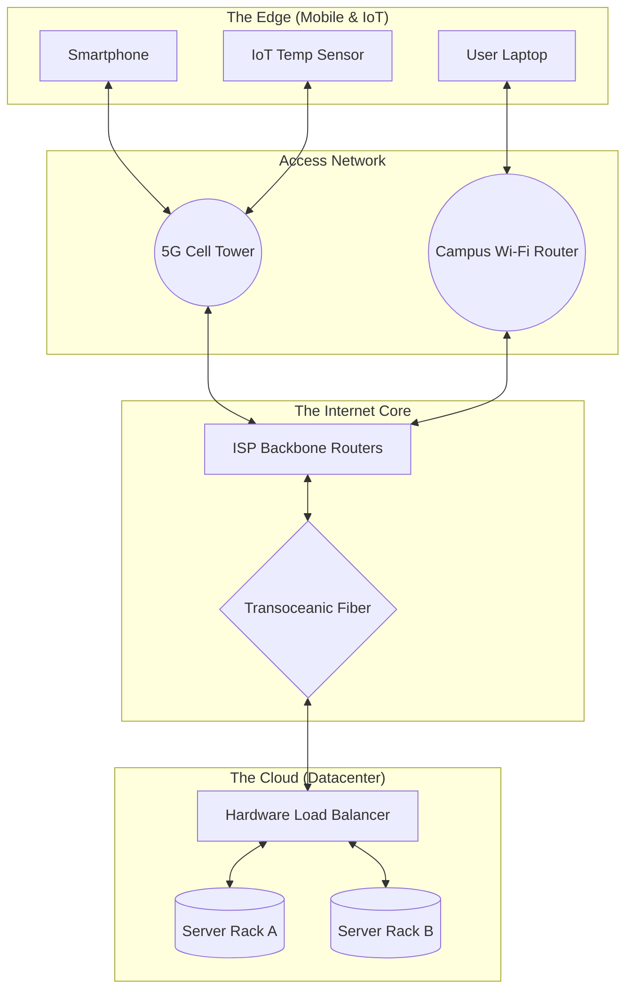

# Physical Models in Distributed Systems

## Explanation

While *Architectural Models* define the logical software structure of a system, a **Physical Model** captures the explicit hardware reality. It is the literal mapping of computers (nodes) and the cables or wireless signals (interconnects) that join them together. As a systems engineer, understanding the physical model is non-negotiable because it dictates the absolute physical limits of your system: you cannot write software that transmits data faster than the speed of light through the physical fiber-optic cables connecting your nodes.

Historically, the physical model of distributed computing has evolved through three distinct generations:

1. **Early Distributed Systems (1970s - 1980s):** 
   - **Scale:** 10 to 100 nodes.
   - **Topology:** A single local area network (LAN) like Ethernet or Token Ring.
   - **Characteristics:** Homogeneous hardware, entirely isolated from the global Internet, used primarily for sharing local resources like a high-speed printer or a departmental file server.
2. **Internet-Scale Distributed Systems (1990s - 2000s):** 
   - **Scale:** Thousands to millions of nodes globally.
   - **Topology:** Intranets (corporate LANs) connected via routers and firewalls to the public Internet core.
   - **Characteristics:** Highly heterogeneous (mixing UNIX servers, Windows desktops). The physical reality of geographical distance introduced significant, variable network latency and packet loss.
3. **Contemporary Distributed Systems (2010s - Present):** 
   - **Scale:** Billions of nodes.
   - **Topology:** Massive, multi-tiered networks.
   - **Characteristics:** Defined by *Mobility* and *Ubiquity*. The physical model now spans from massive, hyper-dense Cloud Datacenters (with tens of thousands of blade servers in a single building) down to low-power, intermittent mobile networks (4G/5G) and embedded Internet of Things (IoT) sensors.

**Block Diagram of a Contemporary Physical Model:**

## Example

**A Modern University Campus Network**
To visualize a physical model, look at a modern university:
- **The Nodes:** Thousands of diverse devices. Students walking with iPhones (mobile nodes), heavy graphical workstations in the Engineering lab (desktop nodes), and the massive database servers in the IT basement (server nodes).
- **The Interconnects:** The physical medium dictates performance. The student's iPhone uses wireless RF signals (Wi-Fi 6) which drop packets when they walk behind a concrete pillar. The lab workstations are hardwired with CAT6 ethernet cables (1 Gbps, highly reliable). The IT basement servers are connected via optical fiber (10 Gbps, near-zero latency).
Software must be designed to tolerate the physical realities of these different connections.

## Applications & Use Cases

1. **Cloud Computing Datacenters:** At the cloud tier, the physical model involves massive racks of servers, top-of-rack (ToR) switches, and cooling infrastructure. Understanding the physical layout is essential; if two Virtual Machines communicate heavily, the hypervisor should physically place them on the same physical server rack to avoid saturating the datacenter's core network switches.
2. **IoT Precision Agriculture:** The physical model dictates the protocol. A soil sensor buried in a field lacks the physical battery power to transmit Wi-Fi. Therefore, the physical model uses LoRaWAN (Low Power, Long Range) to transmit tiny packets to a physical edge gateway sitting on a barn, which then uses a wired connection to reach the cloud.
3. **Content Delivery Networks (CDNs):** The entire premise of a CDN is based on the physical model. Because data cannot travel faster than light, physical distance equals latency. CDNs physically place SSD-heavy caching servers in Internet Exchange Points (IXPs) worldwide to be geographically closer to the end-user.

## 3 Solved Numerical/Analytical Examples

**Example 1: Analyzing Physical Network Delay (Speed of Light Limit)**
*Problem:* In an Internet-Scale physical model, a client in New York sends a 1 KB request to a server in London. The physical distance along the fiber optic cables is approximately 5,500 km. The speed of light in fiber is roughly $2 \times 10^8$ m/s. The server takes exactly 10 ms to process the request, and the response is 2 KB. Assuming the network bandwidth is 1 Gbps (making transmission delay negligible), calculate the absolute minimum theoretical turnaround time.
*Solution:*
1. Calculate one-way physical propagation delay: 
   Delay = $\frac{\text{Distance}}{\text{Speed}} = \frac{5500 \times 10^3 \text{ meters}}{2 \times 10^8 \text{ meters/second}}$
   Delay = $0.0275 \text{ seconds} = 27.5 \text{ ms}$.
2. Total Turnaround Time = (Request Propagation) + (Processing) + (Response Propagation)
3. Total = $27.5 \text{ ms} + 10 \text{ ms} + 27.5 \text{ ms} = 65 \text{ ms}$.
*Conclusion:* No matter how fast your software is, the physical model dictates a hard mathematical floor of 65 ms latency due to geographical distance.

**Example 2: Node Failure Probability in a Cloud Datacenter**
*Problem:* A contemporary physical model includes a compute cluster of $N = 1000$ blade servers. The hardware manufacturer rates the Mean Time Between Failures (MTBF) for a single server at 3 years (approx 1000 days). Assuming failures are independent, what is the expected frequency of hardware failures in the entire cluster?
*Solution:*
1. Calculate the failure rate ($\lambda$) of a single physical node:
   $\lambda = \frac{1}{\text{MTBF}} = \frac{1}{1000} \text{ failures/day}$.
2. The aggregate failure rate for the entire cluster is $N \times \lambda$:
   Cluster Failure Rate = $1000 \times \left(\frac{1}{1000}\right) = 1 \text{ failure/day}$.
*Conclusion:* In massive physical models, hardware failure is not a rare anomaly; it is a daily, guaranteed physical occurrence. Software must be built to mask this.

**Example 3: Mobile Node Bandwidth Degradation**
*Problem:* A mobile node (smartphone) moves away from its physical Wi-Fi access point. Due to physical signal attenuation (inverse-square law), its available bandwidth drops from 54 Mbps to 6 Mbps. Calculate the time penalty incurred when trying to download a 100 Megabyte (MB) application update at the edge of the physical network.
*Solution:*
1. Convert the file size to bits to match bandwidth units: 
   $100 \text{ MB} = 100 \times 8 = 800 \text{ Megabits (Mb)}$.
2. Calculate transfer time near the router (54 Mbps):
   Time = $\frac{800 \text{ Mb}}{54 \text{ Mbps}} \approx 14.81 \text{ seconds}$.
3. Calculate transfer time at the physical edge (6 Mbps):
   Time = $\frac{800 \text{ Mb}}{6 \text{ Mbps}} \approx 133.33 \text{ seconds}$.
4. Time Penalty = $133.33 - 14.81 = 118.52 \text{ seconds}$.
*Conclusion:* Physical mobility introduces extreme variability in performance that distributed algorithms must dynamically handle.

## Previous Year Questions & Solutions

**[April 2018] Describe the physical models of distributed systems. [5 Marks]**
*Solution:*
A **Physical Model** is the most explicit, hardware-centric way to describe a distributed system. It captures the literal composition of the system: the specific computers (nodes) and the physical communication mediums (cables, RF signals) that interconnect them. It ignores software abstractions to focus on physical realities like geography, hardware failure rates, and signal latency.

The evolution of physical models spans three distinct generations:
1. **Early Distributed Systems (1970s - 1980s):** 
   Consisted of a small number (10 to 100) of homogeneous nodes connected by a single, isolated local area network (LAN). They were primarily used for local resource sharing (like printers) within a single building.
2. **Internet-scale Distributed Systems (1990s - 2000s):** 
   Characterized by the widespread adoption of the Internet. The model expanded geographically to include intranets connected via firewalls, linking highly heterogeneous physical computers (desktops, mainframes, servers) across vast transoceanic distances, introducing significant physical latency.
3. **Contemporary Distributed Systems (2010s - Present):** 
   Characterized by extreme physical scale (billions of nodes), mobility, and ubiquity. The physical model now incorporates massive, hyper-dense cloud datacenters at the core, and highly mobile laptops, smartphones, and embedded IoT sensors at the edge, utilizing a mix of wired fiber and intermittent wireless RF networks.
